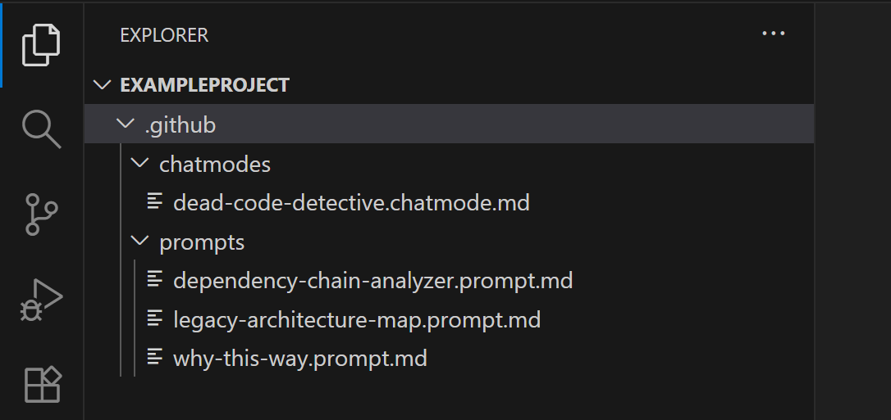
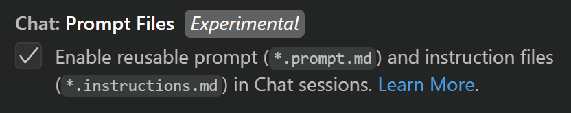
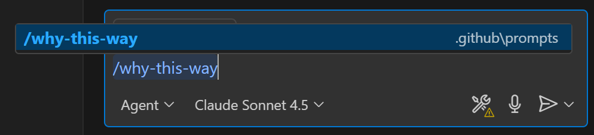
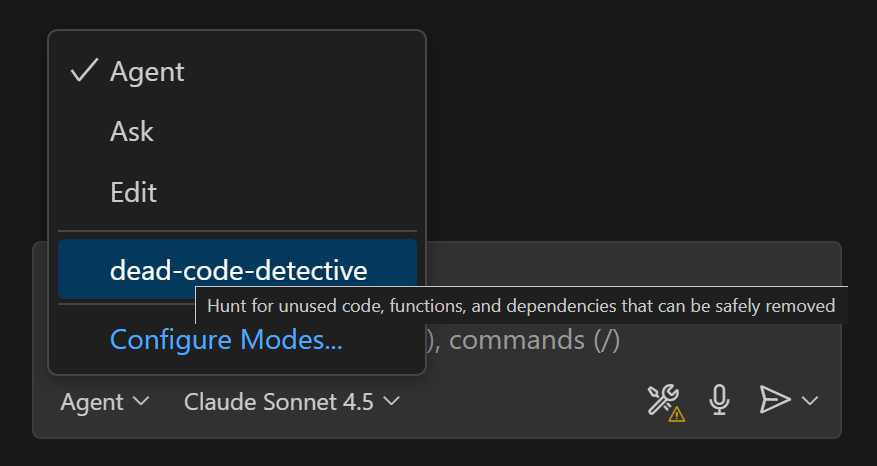
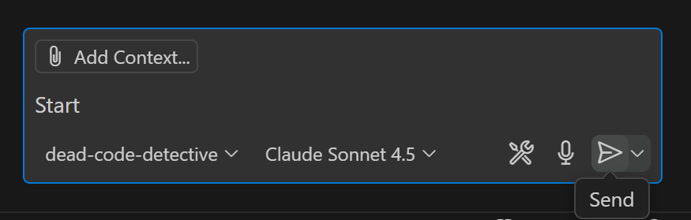

# GitHub Copilot Toolkit

This repository contains my collection of GitHub Copilot prompts, chat modes, and other tools designed to help enterprises maximize value from GitHub Copilot, especially in large, complex, and legacy codebases.

These resources are:
- **Constantly evolving** – updated based on real-world usage and feedback
- **Not perfect** – consider them starting points for your own customization
- **Enterprise-focused** – optimized for complex organizational needs

## Included Chat Modes

**[Dead Code Detective](.github/chatmodes/dead-code-detective.chatmode.md)**: Systematically identifies unused code, functions, classes, and dependencies using a safety-first approach that checks for dynamic invocation, reflection, and configuration-driven usage patterns. Categorizes findings by confidence level and includes handoffs to review results, create removal plans, and execute cleanup safely.

## Included Prompts

**[Why This Way?](.github/prompts/why-this-way.prompt.md)**: Investigates puzzling code by analyzing its purpose, reviewing git history, and examining architectural context. Generates a report explaining what the code does, why it exists, and whether refactoring would be beneficial.

**[Legacy Architecture Map](.github/prompts/legacy-architecture-map.prompt.md)**: Systematically explores codebases to create or refine architecture maps, identifying entry points, modules, layers, data flow, and dependencies. Works in both initial analysis and refinement modes, producing structured documentation with Mermaid diagrams.

**[Dependency Chain Analyzer](.github/prompts/dependency-chain-analyzer.prompt.md)**: Traces complete dependency chains for the active file in both directions, mapping transitive relationships multiple levels deep. Identifies circular dependencies, calculates blast radius, and supports iterative refinement of existing analyses.

## How to use
- Clone or download this repo, then copy any folders you want (`.github/chatmodes`, `.github/prompts`) into your workspace or profile locations.

- See the diagram below for an example workspace structure:

  
If you want to keep the chatmodes and/or prompts locally without sharing them in your repo, store them in the current [VS Code profile](https://code.visualstudio.com/docs/configure/profiles).

### Prompts

1. Enable prompt files via `setting(chat.promptFiles)`.

   

2. Run the prompts with `/prompt-name` (for example `/why-this-way.prompt.md`) in the chat window.

   

3. More information about working with prompts is available in the [official documentation](https://code.visualstudio.com/docs/copilot/customization/prompt-files).

### Chat Modes

1. Select a chat mode by clicking the chat mode picker in the chat window.

   

2. You can simply start chatting with the selected mode active. Even a message like `Start` is enough to trigger the mode's behavior.

   

3. More information about working with chat modes is available in the [official documentation](https://code.visualstudio.com/docs/copilot/customization/custom-chat-modes)